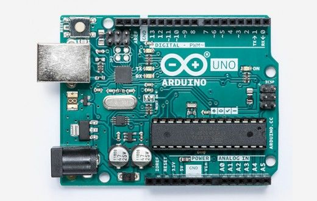

### We going to try keep this as short as possible, we could write quite a bit about this...

Well lets this extract from Arduino themselves might give you a good idea...

> Arduino is an open-source electronics platform based on easy-to-use hardware and software. Arduino boards are able to read inputs - light on a sensor, a finger on a button, or a Twitter message - and turn it into an output - activating a motor, turning on an LED, publishing something online. You can tell your board what to do by sending a set of instructions to the microcontroller on the board. To do so you use the Arduino programming language (based on Wiring), and the Arduino Software (IDE), based on Processing.

Arduino has been as is, one of the most famous development platforms in the world.

Its simple language and easy to use hardware has made it popular among not only electronic enthusiasts, but also architects, artists, educators and many more.

It is also fully Open Source, like us! You can check out their Github...

This is one example of their popular boards... It is the Arduino Uno Rev 3. 



Example code which is called "Blink", which just makes a LED attached to pin 13 turn on and off in 1 second intervals...

```cpp
/* Blinking LED
 * ------------
 *
 * turns on and off a light emitting diode(LED) connected to a digital  
 * pin, in intervals of 2 seconds. Ideally we use pin 13 on the Arduino 
 * board because it an LED built-in
 *
 * Created 1 June 2005
 * copyleft 2005 DojoDave <http://www.0j0.org>
 * http://arduino.berlios.de
 *
 * based on an orginal by H. Barragan for the Wiring i/o board
 */

int ledPin = 13;                // LED connected to digital pin 13

void setup()
{
  pinMode(ledPin, OUTPUT);      // sets the digital pin as output
}

void loop()
{
  digitalWrite(ledPin, HIGH);   // sets the LED on
  delay(1000);                  // waits for a second
  digitalWrite(ledPin, LOW);    // sets the LED off
  delay(1000);                  // waits for a second
}
```

There are many ways to compile this code and upload it to your device. This will be discussed in another post.

It is worth noting that our current range of development boards depend heavily on the work of Arduino. We grew up using them in our projects and our education.

With this being said, please also check out our work on Github...
